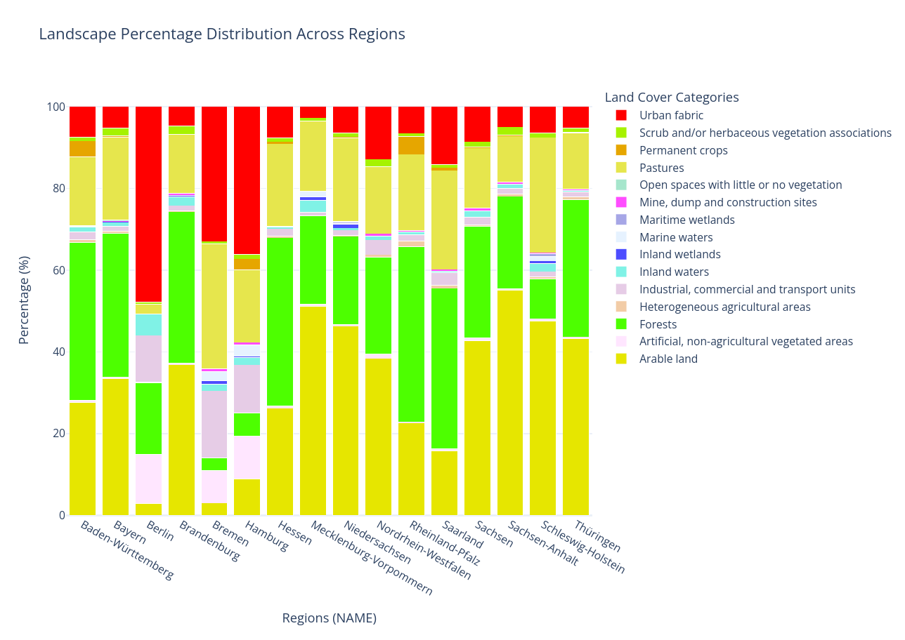

# Landscape Distribution Plotting Script

## Introduction
This Python script provides an efficient way to visualize the distribution of landscape categories (from CORINE Land Cover data) across different regions, using stacked bar charts. The script uses Plotly for interactive chart generation and allows users to explore landscape composition at various aggregation levels (e.g., by region, land cover type). The flexibility of the script enables easy adaptation to different datasets and land cover categories, offering a powerful tool for geographic and environmental analysis.



## Features
- **Interactive Stacked Bar Chart**: Visualizes the percentage of land cover categories per region.
- **Flexible Aggregation**: Supports different aggregation levels (e.g., by land cover type or region).
- **Hover Customization**: Hover tooltips display percentages rounded to one decimal place with a `%` symbol.
- **Customizable Input**: Easily adjust the input CSV files for different datasets or land cover categories.

## System Requirements
- **Python 3.7+**  
- **Libraries**:  
  - `pandas`
  - `plotly` (for interactive charts)
  - `matplotlib` (for additional plotting capabilities)
  - `matplotlib.patheffects` (for custom path effects)
  
  You can install these dependencies using `pip`:

  ```bash
  pip install pandas plotly matplotlib